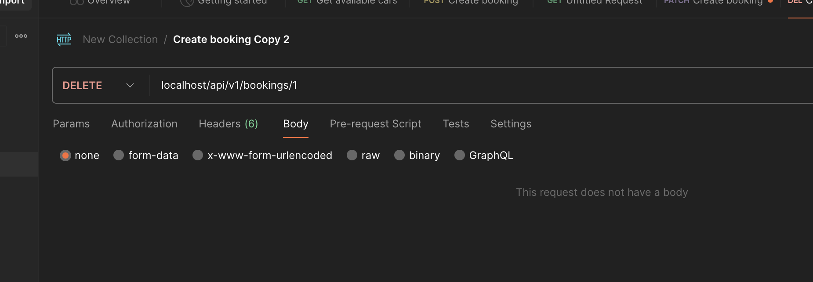

# EnjoyTravel Tech Test
## Set-up
- Run `./vendor/bin/sail up -d` to bring up Docker.
- Run migrations: `docker-compose run app php artisan migrate` (ideally add to dockerfile)
- Seed data: `docker-compose run app php artisan db:seed`

## Endpoints

You can view the API's in the browser by going to [http://localhost/docs](http://localhost/docs).

### Get cars available for hire


```
curl --location 'localhost/api/v1/cars?from_date=2025-04-06%2000%3A00%3A00&to_date=2025-04-06%2000%3A00%3A00&age=55' \
--header 'Accept: application/json'
```

### Create booking


```
curl --location 'localhost/api/v1/bookings' \
--header 'Accept: application/json' \
--header 'Content-Type: application/json' \
--data '{
    "from_date": "2027-01-01 00:00:00",
    "to_date": "2027-02-01 00:00:00",
    "car_id": 1
}'
```

### Update booking


```
curl --location --request PATCH 'localhost/api/v1/bookings/1' \
--header 'Accept: application/json' \
--header 'Content-Type: application/json' \
--data '{
    "from_date": "2027-01-01 00:00:00",
    "to_date": "2027-02-01 00:00:00",
    "car_id": 2
}'
```

### Delete booking



```
curl --location --request DELETE 'localhost/api/v1/bookings/1'
```

## Linting 
Run `docker-compose run app bin/lint`

## Tests
### PHP
Run `docker-compose run app ./vendor/bin/phpunit`

## If I had more time / other musings
- Feature tests on booking CRUD endpoints
- OAUTH Authentication / User stored on booking
- More user friendly validation errors
- Pipeline / CI / CD
- Caching on bookings (kept fresh using events) / cars
- Has potential to use ElasticSearch, but over-engineering at this point